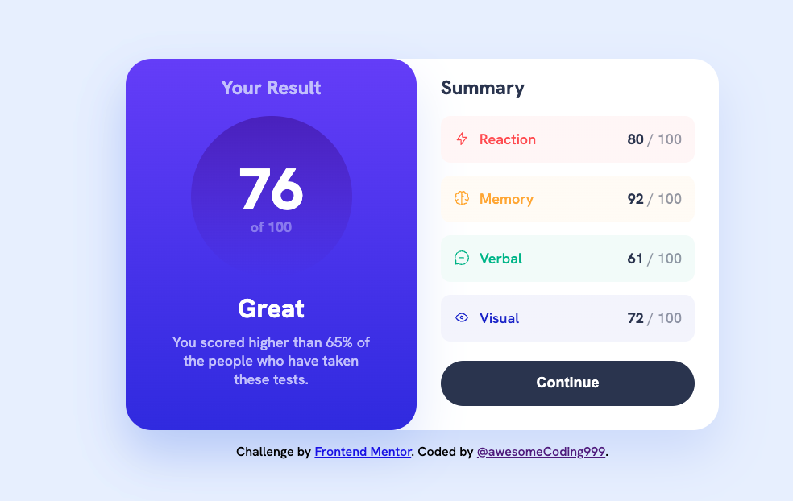

# Frontend Mentor - Results summary component solution<!-- omit in toc -->

## Final Mobile<!-- omit in toc -->

## Final Desktop<!-- omit in toc -->

## Table of contents<!-- omit in toc -->

- [Overview](#overview)
  - [The challenge](#the-challenge)
  - [Links](#links)
- [My process](#my-process)
  - [Built with](#built-with)
- [Author](#author)

## Overview

### The challenge

Users should be able to:

- View the optimal layout for the interface depending on their device's screen size
- See hover and focus states for all interactive elements on the page

### Links

- [GitHub repo](https://github.com/awesomeCoding999/frontend-mentor-results-summary-component)
- [Live site](https://awesomecoding999.github.io/frontend-mentor-results-summary-component/)

## My process

### Built with

- Semantic HTML5 markup
- CSS custom properties
- Flexbox
- Mobile-first workflow

## Author

- Frontend Mentor - [@awesomeCoding999](https://www.frontendmentor.io/profile/awesomeCoding999)
